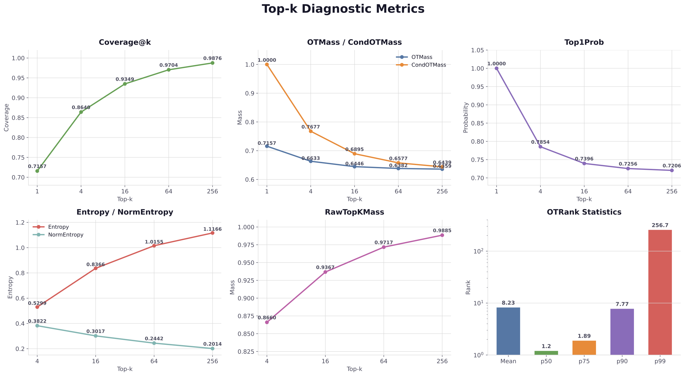
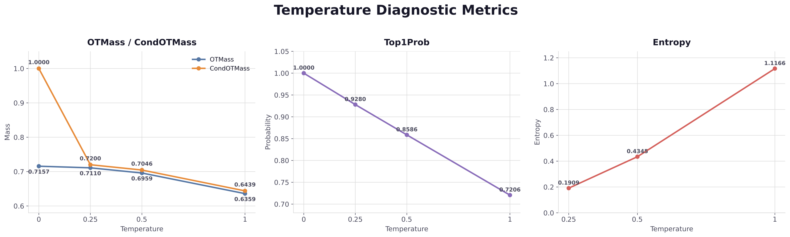
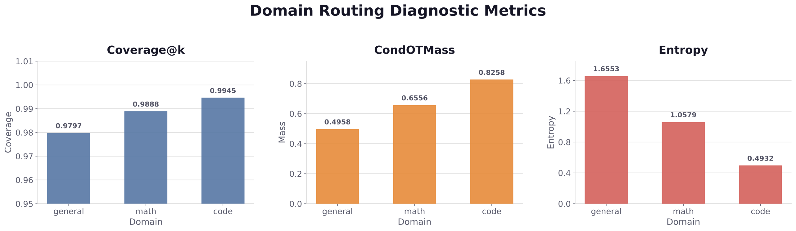

# Let the Data Decide

**Supervision Analysis, Capability Trade-offs, and Adaptive Objective Routing in Continued Pre-training via Off-Policy Distillation**

Jiangan Yuan\*, Zhixuan Li\*, Han Xu
(\* equal contribution)

[📄 Paper (PDF)](./Let_the_Data_Decide.pdf) · [arXiv](#) · [Citation](#citation)

---

## TL;DR
[Chinese Version HERE](./README_zh.md)

We study top-`k`-truncated, temperature-scaled off-policy distillation as a **structured supervision design problem**, not a global hyperparameter choice. By decomposing the LM vs. KD gradient gap at the token level and introducing diagnostic metrics that quantify **teacher–data alignment**, we show that

- `k` governs a **coverage–sharpness trade-off**;
- `τ` controls **within-support probability allocation** (orthogonal to support membership);
- **Domain-level objective routing** (LM for math/code, KD for general data) consistently outperforms both single-objective baselines and finer-grained token-level routing — because what determines routing effectiveness is the *quality of the routing signal* (teacher–data alignment), not its granularity.

This reframes off-policy distillation in continued pre-training as **data-conditional supervision design**.

---

## Key Contributions

1. **Capability divergence is structural, not noise.** Under identical training data, initialization, and hyperparameters, LM and KD induce *systematically distinct* capability profiles — LM dominates on high-difficulty reasoning, math, and Pass@K (e.g. +29.86 on MATH-500 Pass@16, +23.33 on AIME 2025 Pass@128); KD dominates on commonsense, factual retrieval, reading comprehension, and structured program synthesis. Neither is uniformly better.

2. **A gradient-level decomposition** of LM vs. KD that identifies two complementary supervision signals: **direct observed-token reinforcement** and **teacher-supported alternative supervision**. Their relative balance is fully governed by whether the observed token falls in the teacher top-`k` support and how target mass is allocated within it.

3. **A diagnostic metrics suite** — Coverage@k, OTRank, OTMass, CondOTMass, Top1Prob, Entropy, RawTopKMass — that makes the supervision signal *measurable at every training position*, turning the qualitative LM↔KD spectrum into quantifiable trade-offs.

4. **Controlled sweeps separate the two KD degrees of freedom**: `k` shifts coverage at the cost of sharpness; `τ` redistributes mass within a fixed support without changing membership. Different tasks favor different positions on the resulting spectrum.

5. **Domain-level objective routing wins** — applying LM to math/code and KD to general-domain data:
   - Recovers the LM advantage on reasoning/math/Pass@K;
   - Preserves the KD advantage on knowledge and commonsense;
   - **Exceeds both single-objective baselines** on MBPP, BBH, AIME 2024, and AIME 2025.

6. **Token-level routing underperforms domain-level routing**, and between token-level signals, **OTMass > Entropy**. OTMass jointly conditions on the observed token and the teacher distribution (capturing alignment); entropy reflects only teacher-side concentration and cannot tell a teacher that *agrees with* the data from one that *confidently disagrees*.

---

## The Logical Loop

The paper is organized as a closed loop **Phenomenon → Mechanism → Measurement → Control → Application → Closure**:

| Step | Section | Output |
|---|---|---|
| 1. **Phenomenon** | §5 | LM and KD induce non-dominant, systematically distinct capability profiles. |
| 2. **Mechanism** | §6.1 | Gradient decomposition reveals two complementary signals: observed-token reinforcement vs. teacher-supported alternative supervision. |
| 3. **Measurement** | §6.2 | Diagnostic metrics make the signal balance quantifiable at every token. |
| 4. **Control** | §6.3, §6.4 | `k` and `τ` modulate the trade-off through *distinct mechanisms*; task-dependent optima. |
| 5. **Application** | §7.1, §7.2 | Domain routing converts the trade-off into a design lever; diagnostic metrics stratified by domain explain *why* it works. |
| 6. **Closure** | §7.3, §7.4, §8 | OTMass > Entropy as a routing signal, because OTMass directly measures the same Eq. (11) component that drove the original mechanism. Routing effectiveness ≠ granularity; effectiveness = signal alignment with the underlying gradient gap. |

The closure step is what gives the paper its central thesis: **off-policy distillation is structured, data-conditional supervision design** — exactly what the title claims.

---

## Method

### Off-policy KD Objective

Given a teacher `f_T` and student `f_S`, the standard interpolated objective is

```
L = (1 - α) · L_LM + α · L_KD
L_KD = (1/n) Σ_r KL( p̃_T^{k,τ}(· | x_<r) ‖ p_S(· | x_<r) )
```

where `p̃_T^{k,τ}` is the top-`k`-truncated, temperature-scaled, renormalized teacher distribution.

### Gradient Gap (Eq. 11)

```
Δg_i  =  ∂L_KD/∂z_i^S  -  ∂L_LM/∂z_i^S  =  1[i = x] - p̃_T^{k,τ}_i
```

The student distribution cancels — the gap depends only on the discrepancy between the one-hot data target and the truncated teacher target.

| Case | Effect on observed token `x` | Effect on teacher-supported alternatives |
|---|---|---|
| `x ∈ K^T` | KD applies weaker upward pressure than LM (mass diluted to alternatives) | Non-suppressive update; sometimes net increase |
| `x ∉ K^T` | Sign reversal: LM increases `z_x`, KD suppresses it | Same as above |

### Diagnostic Metrics

| Metric | Definition | Invariances |
|---|---|---|
| **Coverage@k** | `1[x_r ∈ K_r^T]` | depends only on `k`; τ-invariant |
| **OTRank** | rank of `x_r` under teacher logits | τ-invariant |
| **OTMass** | `p̃_T^{k,τ}_{r, x_r}` | sensitive to `k`, `τ`; zero when `x_r ∉ K_r^T` |
| **CondOTMass** | OTMass conditioned on `x_r ∈ K_r^T` | isolates within-support allocation |
| **Top1Prob** | `p̃_T^{k,τ}_{r, (1)}` | concentration on teacher's top token |
| **Entropy / NormEntropy** | `H(p̃_T^{k,τ})` / `H / log k` | softness of the target |
| **RawTopKMass** | pre-truncation mass on `K_r^T` | mass discarded by truncation |

---

## Experimental Setup

### Pruning–Distillation Scaling Ladder

To make controlled experimentation feasible while preserving large-model behavioral priors, we build a multi-stage pruning–distillation ladder from DeepSeek V3 Base:

| Rung | Parent | Total / Active Params | Distillation Tokens |
|---|---|---|---|
| `M_0` (DeepSeek V3 Base) | — | 671B / 37B | — |
| `M_1` | `M_0` | 128B / 19B | 1T |
| `M_2` | `M_1` | 59B / 10B | 200B |
| `M_3` (student) | `M_2` | 24B / 4.5B | 200B |

**Teacher:** DeepSeek V3.1 Base (stronger than V3 Base on internal evals).
**Student:** `M_3`. All RQ1/RQ2 experiments train on 100B tokens from a 33% general / 40% math / 27% code mixture.

### Evaluation

- 13-benchmark suite (PIQA, HellaSwag, MMLU, TriviaQA, RACE, DROP, MMLU-Pro, BBH, C-Eval, CMMLU, MBPP, GSM8K, MATH).
- Pass@K (K ∈ {1, 16, 64, 128}) on MATH-500, AIME 2024, AIME 2025, HumanEval.

---

## Key Results

### LM vs. KD — Capability profiles diverge systematically

| Benchmark | LM | KD | Gap |
|---|---:|---:|---:|
| MMLU-Pro | **43.98** | 39.74 | +4.24 LM |
| MATH (Minerva) | **43.38** | 40.64 | +2.74 LM |
| MATH-500 Pass@16 | **60.75** | 30.89 | +29.86 LM |
| AIME 2025 Pass@128 | **23.33** | 0.00 | +23.33 LM |
| HumanEval Pass@1 | **29.63** | 22.79 | +6.84 LM |
| PIQA | 79.16 | **80.63** | +1.47 KD |
| DROP | 51.59 | **53.37** | +1.78 KD |
| MBPP | 53.00 | **54.80** | +1.80 KD |

### Top-`k` — Coverage–sharpness trade-off



*Figure 1. Diagnostic statistics for top-`k` truncated teacher distributions at τ = 1.*

| `k` | Coverage@k | CondOTMass | Top1Prob | NormEntropy |
|---:|---:|---:|---:|---:|
| 1 | 0.7157 | 1.0000 | 1.0000 | — |
| 4 | 0.8640 | 0.7677 | 0.7854 | 0.3822 |
| 16 | 0.9349 | 0.6895 | 0.7396 | 0.3017 |
| 64 | 0.9704 | 0.6577 | 0.7256 | 0.2442 |
| 256 | 0.9876 | 0.6439 | 0.7206 | 0.2014 |

Median OTRank ≈ 1; 90th percentile = 7.77; 99th percentile = 256.7 → most observed tokens already sit inside Top-4/16; large `k` mainly adds tail dilution.

### Temperature — Within-support allocation only



*Figure 2. Diagnostic statistics for top-256 truncated teacher distributions under different distillation temperatures.*

At fixed `k = 256`, varying `τ` leaves `Coverage@k` and `OTRank` invariant but shifts mass from the top-ranked token toward lower-ranked alternatives:

| `τ` | OTMass | CondOTMass | Top1Prob | Entropy |
|---:|---:|---:|---:|---:|
| → 0 | 0.7157 | 1.0000 | 1.0000 | — |
| 0.25 | 0.7110 | 0.7200 | 0.9280 | 0.1909 |
| 0.5 | 0.6959 | 0.7046 | 0.8586 | 0.4345 |
| 1.0 | 0.6359 | 0.6439 | 0.7206 | 1.1166 |

### Domain-level routing beats both single-objective baselines

| Benchmark | LM | KD | **Domain** |
|---|---:|---:|---:|
| MMLU-Pro | 43.98 | 39.74 | **43.72** |
| MATH (Minerva) | 43.38 | 40.64 | **43.58** |
| BBH | 69.90 | 69.33 | **70.74** |
| MBPP | 53.00 | 54.80 | **58.40** |
| MATH-500 Pass@128 | 84.40 | 63.00 | **83.20** |
| AIME 2024 Pass@128 | 23.33 | 10.00 | **33.33** |
| AIME 2025 Pass@128 | 23.33 | 0.00 | **23.33** |

### Why domain routing works — diagnostics stratified by domain



*Figure 3. Domain-stratified diagnostic metrics under top-256 distillation with τ = 1.*

| Domain | Coverage@k | CondOTMass | Entropy |
|---|---:|---:|---:|
| general | 0.9797 | 0.4958 | 1.6553 |
| math | 0.9888 | 0.6556 | 1.0579 |
| code | 0.9945 | 0.8258 | 0.4932 |

Math/code data exhibit much higher CondOTMass and much lower entropy → the teacher distribution is already well-aligned with the observed token, so LM (which fully reinforces the observed token) extracts more signal than KD (which dilutes it). General data shows the opposite — teacher-supported alternatives carry meaningful information, so KD wins.

### Token-level routing — granularity is not enough

| Benchmark | LM | KD | OTMass (T=0.37) | Entropy (T=0.5) | **Domain** |
|---|---:|---:|---:|---:|---:|
| MMLU-Pro | 43.98 | 39.74 | 41.42 | 43.86 | **43.72** |
| MATH (Minerva) | 43.38 | 40.64 | 41.98 | 41.94 | **43.58** |
| MATH-500 Pass@128 | **84.40** | 63.00 | 74.00 | 69.40 | 83.20 |
| AIME 2024 Pass@128 | 23.33 | 10.00 | 3.33 | 13.33 | **33.33** |
| RACE | **46.89** | 45.74 | 45.65 | 39.33 ⚠️ | 44.98 |

OTMass is more stable than Entropy because it directly measures the same Eq. (11) component that drove the original gradient gap; Entropy reflects only teacher-side concentration and cannot distinguish *teacher agrees with data* from *teacher confidently disagrees*.

---

## What This Reframes

Off-policy distillation in continued pre-training is not a global recipe to be tuned, and it is not a binary LM-vs-KD choice. It is a **structured, data-conditional supervision design problem** with three coupled degrees of freedom:

1. **Routing signal** — what data property determines objective assignment;
2. **Objective family** — `(α, k, τ, divergence)` jointly position supervision along the reinforcement↔alternatives spectrum;
3. **Routing rule** — fixed thresholds, learned policies, or capability-aware mappings.

Future directions include (a) clarifying whether packed-sequence context contamination is what penalizes token-level routing, (b) extending routing beyond the binary LM/KD choice to configurations within the KD family, and (c) learned routing policies grounded in teacher–data alignment rather than teacher-side uncertainty alone.

---

## Citation

```bibtex
@article{yuan2026letdatadecide,
  title   = {Let the Data Decide: Supervision Analysis, Capability Trade-offs,
             and Adaptive Objective Routing in Continued Pre-training via
             Off-Policy Distillation},
  author  = {Yuan, Jiangan and Li, Zhixuan and Xu, Han},
  journal = {arXiv preprint},
  year    = {2026}
}
```